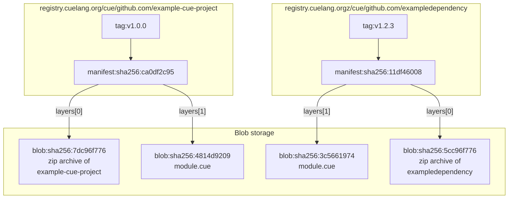

# Proposal: CUE modules storage model

Status: **Draft**

Lifecycle:  **Proposed**

Author(s): rog@cue.works

Relevant Links:

Reviewers: mpvl@cue.works myitcv@cue.works

Discussion Channel: [GitHub](https://github.com/cue-lang/cue/discussions/2941)


## Abstract

This document is an adjunct to the [modules proposal document](2939-modules.md).
We propose using OCI registries to store CUE modules
and proposes a specific storage format for doing so.


## Background

In our proposal document, we propose that
[OCI registries](2939-modules.md#registry) are used
to access and store CUE modules.

Some benefits follow from that approach:

- People deploying workloads to the cloud usually have an OCI registry available to host container content. We can piggyback on that.
- There are multiple registry implementations available and there is a defined standard API for serving and uploading content.
- There are existing standards for signing and attesting to module content inside registries.
- The security model and implementation of OCI registries already exists and is battle tested.

### OCI registries

For those not familiar with the area, OCI registries originated as
a store for Docker images. An image stores a set of layers that,
when combined, form the contents of a filesystem in which a Docker
container will run. The OCI registry API is still substantially the
same as the original Docker API, but various parts have been tweaked
to make them non-Docker-specific. Because these registries are already
deployed as part of many cloud workloads, and because the API is largely
content-agnostic, people have started to use them to store arbitrary other
artifacts too, thus reducing the number of deployed services and overall
complexity. [This talk](https://www.youtube.com/watch?v=lT2ZMRJrQsU) is
a good introduction to some of the motivations and benefits of doing this.

There are numerous deployed publicly available OCI registries. Examples include:

- [Amazon Elastic Container Registry](https://aws.amazon.com/ecr/)
- [GitHub Container Registry](https://github.blog/2020-09-01-introducing-github-container-registry/)
- [GitLab Container Registry](https://docs.gitlab.com/ee/user/packages/container_registry/)
- [Google Artifact Registry](https://cloud.google.com/artifact-registry)

Broadly, a registry holds a set of independent _repositories_, addressed
by _name_, a slash-separated path. A repository holds a set of _tags_, also
addressed by alphanumeric name, each of which refers to a _manifest_,
which is a JSON document that has references to a set of _blobs_.

See the Design Overview section later in this document for a diagram
illustrating the relationship between some entities in a registry. Note
that although blobs in a registry are logically held within individual
repositories, registry implementations tend to de-duplicate the storage
so that a given blob is held only once within a registry.

As another way of thinking about it: a registry can be modeled with this CUE data structure:

```go
#Registry: {
	// A registry holds a set of repository names.
	repositories: [#RepositoryName]: #Repository
}

#Repository: {
	// Tag digests refer to manifests within a repository.
	Tags: [#TagName]: #Digest

	// Manifest data holds a JSON object that contains
	// "layers" which refer to blob data by digest.
	Manifests: [#Digest]: bytes

	// Blobs hold arbitrary binary data.
	Blobs: [#Digest]: bytes
}

#RepositoryName: =~"^[a-z0-9]+([._-][a-z0-9]+)*(/[a-z0-9]+([._-][a-z0-9]+)*)*$"
#Digest:         string  // e.g. "sha256:0051ba86091f5abf07d5c83701af0002135d574b1f1142931a6fca629e820374"
#TagName:        =~"^[a-zA-Z0-9_][a-zA-Z0-9._-]{0,127}$"
```


## Design overview

Each module will map to a repository in an OCI registry using a custom
artifact type. A module artifact will have resolved all its dependencies
and contain a blob (a.k.a. layer) for itself, each dependency, and
another layer to enable quick access to the `cue.mod/module.cue` file.

Here is a diagram that illustrates how two modules might be stored in
a registry and how dependency data is shared between them.




## Detailed design

We propose that the CUE runtime will be responsible for mapping from
a module path to a repository within a specific registry and retrieving
module contents from there. That registry can be configured at runtime and
could be any service that implements the OCI registry API: for example,
a cluster-local registry, the central CUE registry, or some ad hoc registry
implementation created for a specific use case.

That is, import paths will _not_ contain the name of the registry that
stores the module data. This creates a level of indirection between
CUE code which uses module paths to refer to modules, and the actual
infrastructure that the code for packages within the module is retrieved
from.

The location of modules will be determined by a _registry configuration_.
In the simplest case, this involves setting the environment variable
`CUE_REGISTRY` to the name of the registry. However there
are various other possibilities to choose how modules are
stored in a set of registries. See [#registry-configuration] for details
on this.

In general, any given module path resolves to a tagged
[manifest](https://github.com/opencontainers/image-spec/blob/main/manifest.md)
within a repository within a host registry.

To promote maximum compatibility with existing registries, this
manifest will have media type `application/vnd.oci.image.manifest.v1+json` as defined
[here](https://github.com/opencontainers/image-spec/blob/main/manifest.md#image-manifest).
As such, the `config` field refers to a
[scratch configuration](https://github.com/opencontainers/image-spec/blob/main/manifest.md#example-of-a-scratch-config-or-layer-descriptor)
which holds the media type that defines the actual module artifact type
`application/vnd.cue.module.v1+json`. The blob pointed to by each "layer" of the manifest (these are not actually
layers as such, despite the field name) holds the module
contents and those of its dependencies.

Specifically:

- the first layer (layer 0) represents the actual content of the module's archive, in `archive/zip` format.
- the second layer (layer 1) holds the contents of the
`cue.mod/module.cue` file. This makes it easy for the dependency
resolution logic to extract this file quickly without the need to download
and decompress the entire archive zip. The media type of this layer is
`application/vnd.cue.modulefile.v1` (TODO decide on final spelling for
media type).

### Validity checking

Modules will be checked for validity before being allowed into the central
registry. The set of checks that this implies is potentially open-ended,
but from this document’s point of view, the important ones are:

- the `module.cue` file exists and is valid.
- all dependencies are fully evaluated and the `module.cue` file accurately reflects those dependencies.
- all imported packages have a corresponding module mentioned in the `module.cue` file.
- all modules mentioned in the `module.cue` file are actually used somewhere inside the CUE.

The above criteria can be ensured by running `cue mod tidy` before uploading a module.

## Security

See the [Supply Chain Security sub-proposal](./2450-supply-chain-security.md) for a discussion of security aspects of modules.

## Registry configuration

The registry configuration determines how CUE maps modules to their locations in
OCI registries.

Given a particular registry configuration, it is possible to work what registry a
given module is stored in, and what repository within that registry, without
making any network calls.

If no explicit registry configuration is present, a default central registry
will be used for all modules.

The simplest way of specifying a registry configuration is to set `$CUE_REGISTRY`
to the hostname of that registry.

Examples:

```
CUE_REGISTRY=myregistry.example
CUE_REGISTRY=localhost:5000
CUE_REGISTRY='[::1]:5000'
```

If a repository path is present too, all modules will be stored under that path.

For example:

```
CUE_REGISTRY=localhost:5000/all/modules/will/be/stored/here
```

By default for hosts other than localhost, a secure (HTTPS) connection will be
used. This default can be set by appending "+insecure" or "+secure".

For example:

```
CUE_REGISTRY=100.98.141.117:5000+insecure
CUE_REGISTRY=localhost:5000/modules+secure
```

When specified in this way, the registry is used to fetch all modules.

To use a specific registry for only certain subsets of modules, a prefix can be
specified. This constrains a registry to be used only for modules that match
that prefix. If there are multiple registries with a prefix, the longest
matching prefix wins. When matching a prefix, only complete path elements
(non-slash characters) are considered. It is an error if there are two identical
prefixes in the same registry configuration.

For example:

```
CUE_REGISTRY='foo.example/bar=localhost:5000,myregistry.example'
```

In the above example, modules with the prefix "foo.example/bar", such as
"foo.example/bar/somemodule" (but not "foo.example/barry"), will be fetched from
the registry at localhost:5000. All other modules will be fetched from
"myregistry.example".

Note that the syntax above implies that the ordering of the elements in
CUE_REGISTRY isn't important because the resolution algorithm is
order-independent.


### Customizing Name Resolution

Some registries have restrictions on what repositories can be used. For example,
a registry implementation might restrict the depth of the available repository
paths, or might even provide access to a single repository only. In order to
accommodate these kinds of limitation, a registry configuration can also be
specified in CUE syntax, usually as a configuration file.

To do this, set CUE_REGISTRY to "file:" followed by the path to the
configuration file. For example:

```
CUE_REGISTRY=file:/home/alice/.config/cue/registry.cue
```

To remove ambiguity, the simpler syntax described earlier can be explicitly
requested with the "simple:" prefix. For example:

```
CUE_REGISTRY=simple:myregistry.example
```

If it is preferable not to create a file on disk for the configuration, the
"inline:" prefix can be used:

```
CUE_REGISTRY='inline:defaultRegistry: registry: "myregistry.example"'
```

The configuration file syntax is described by the following CUE #file schema
definition:

```
// #file represents the registry configuration schema.
#file: {
	// moduleRegistries specifies a mapping from module path prefix
	// (excluding any version suffix) to the registry to be used for
	// all modules under that path.
	//
	// A prefix is considered to match if a non-zero number of
	// initial path elements (sequences of non-slash characters) in
	// a module path match the prefix.
	//
	// If there are multiple matching prefixes, the longest
	// is chosen.
	moduleRegistries: [#modulePath]: #registry

	// defaultRegistry specifies a fallback registry to be used if no
	// prefix from moduleRegistry matches.
	// If it's not present, a system default will be used.
	defaultRegistry?: #registry
}

#registry: {
	// registry specifies the registry host name and optionally, the
	// repository prefix to use for all modules in the repository,
	// and the security to use when accessing the host.
	//
	// It is in the form:
	// 	hostname[:port][/repoPrefix][+insecure]
	//
	// The hostname must be specified in square brackets if it's an
	// IPv6 address.
	//
	// Connections will be secure unless explicitly specified
	// otherwise, except for localhost connections which default to
	// insecure.
	//
	// See the doc comment on pathEncoding for details as to how
	// repoPrefix is used to determine the repository to use for a
	// specific module.
	//
	// Examples:
	//	"localhost:1234"
	//	"myregistry.example/my-modules+secure"
	registry!: string

	// pathEncoding specifies how module versions map to
	// repositories within a registry.
	// Possible values are:
	// - "path": the repository is used as a prefix to the unencoded
	// module path. The version of the module is used as a tag.
	// - "hashAsPath": the hex-encoded SHA256 hash of the path is
	// used as a suffix to the above repository value. The version
	// of the module is used as a tag.
	// - "hashAsTag": the repository is used as is: the hex-encoded
	// SHA256 hash of the path followed by a hyphen and the version
	// is used as a tag.
	pathEncoding?: "path" | "hashAsRepo" | "hashAsTag"

	// prefixForTags specifies an arbitrary prefix that's added to
	// all tags. This can be used to disambiguate tags when there
	// might be some possibility of confusion with tags in use for
	// other purposes.
	prefixForTags?: #tag

	// TODO we could encode the invariant below in CUE but that
	// would result in poor error messages. With an error builtin,
	// that could perhaps be improved.

	// stripPrefix specifies that the pattern prefix should be
	// stripped from the module path before using as a repository
	// path. This only applies when pathEncoding is "path".
	stripPrefix?: bool
}

// TODO more specific schemas below
#modulePath: string
#tag: string
```


# Discussion

The design also means that the CUE tool will only ever reach out to one
known network address (`$CUE_REGISTRY`) to fetch all dependencies. This
can be useful to know when deploying: access is exclusively through the
named registry.

If two modules are copied into a user's registry and some CUE code is
written that makes use of both of them at the same time, the properties
of the MVS algorithm means that all the required dependencies will be
available even if no other modules have been explicitly copied. This
makes it possible to copy an explicit allow-list of modules without the
need to maintain a list of all their dependencies too.


## Working with custom registries

One of the advantages of using the OCI registry model is that it’s
possible to use a custom or cloud-specific registry to serve content. We
see two main requirements there:

- Copying modules from the central registry into a local registry.
- Uploading private modules to a local registry only.

Note that the destination path should have the module’s path as a
suffix if it is to be used directly by the CUE tool.

To upload a module to a registry, the CUE command provides
`cue publish` subcommand. It will resolve all module dependencies and run all
validity checks as described above before uploading all the dependencies
to the registry.

Once a module is present in a custom registry, it can be used by setting
`$CUE_REGISTRY` to refer to the registry and importing packages from
the module as usual.


# Efficiency

The OCI registry API is designed for large images, not potentially
tiny CUE modules.  This can result in more round trips than strictly
necessary (compared to the Go module proxy API, for example), because
the manifest metadata will need to fetched first, followed by the data
for the actual module.

There are ways to mitigate this:

- the content-addressed nature of an OCI registry means that caching
should be effective.
- for very small blobs, such as some module files, the OCI descriptor
format provides a `data` field that can be used to hold data directly
inside the descriptor, at the cost of some base64-encoding overhead.
