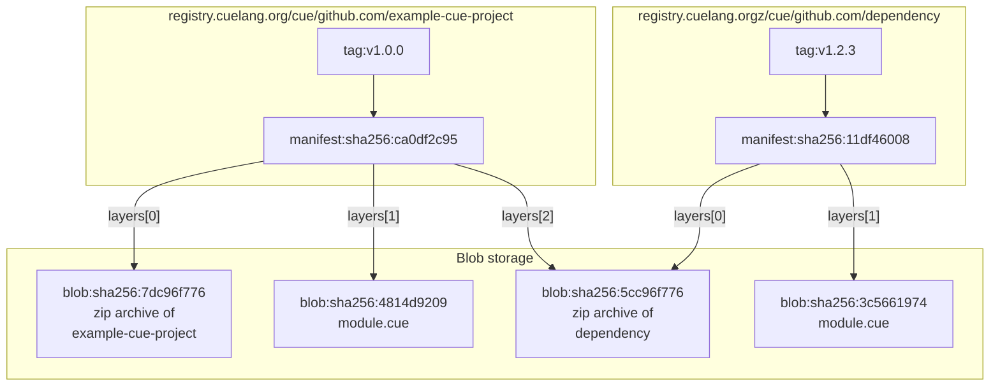

# Proposal: CUE modules storage model

Status: **Draft**

Lifecycle:  **Proposed**

Author(s): rog@cue.works

Relevant Links:

Reviewers: mpvl@cue.works myitcv@cue.works

Discussion Channel: https://github.com/cue-lang/cue/discussions/2449


## Abstract

This document is an adjunct to the [modules proposal document](./2330-modules-v2.md).
We propose using OCI registries to store CUE modules
and proposes a specific storage format for doing so.


## Background

In our proposal document,
we proposed that a [central registry](https://github.com/cue-lang/proposal/blob/main/designs/2330-modules-v2.md#registry) be used
without being specific as to the protocol involved.
In this document, we propose that CUE use the Open Container Initiative (OCI) [registry API](https://github.com/opencontainers/distribution-spec/blob/main/spec.md)
to access and store CUE modules.

Some benefits follow from that approach:

- People deploying workloads to the cloud usually have an OCI registry available to host container content. We can piggyback on that.
- There are multiple registry implementations available and there is a defined standard API for serving and uploading content.
- There are existing standards for signing and attesting to module content inside registries.
- The security model and implementation of OCI registries already exists and is battle tested.

Initially, we will use a model where an agent  will copy content to the central registry on behalf of
the user, checking for module validity as it does so. This sidesteps
questions of how authorization will be obtained to upload a module.
Instead, anyone that controls a GitHub repository will be able to create
content in the CUE registry under that part of the namespace.
See [here](2448-modules-github.md) for more detail.

Note: the future we plan to allow modules in arbitrary parts of the
namespace, not just within github.

### OCI registries

For those not familiar with the area, OCI registries originated as
a store for Docker images; an image stores a set of layers that,
when combined, form the contents of a filesystem in which a Docker
container will run. The OCI registry API is still substantially the
same as the original Docker API, but various parts have been tweaked
to make them non-Docker-specific. Because these registries are already
deployed as part of many cloud workloads, and because the API is largely
content-agnostic, people have started to use them to store arbitrary other
artifacts too, thus reducing the number of deployed services and overall
complexity. [This talk](https://www.youtube.com/watch?v=lT2ZMRJrQsU) is
a good introduction to some of the motivations and benefits of doing this.

Broadly, a registry holds a set of independent _repositories_, addressed
by _name_, a slash-separated path. A repository holds a set of _tags_, also
addressed by alphanumeric name, each of which refers to a _manifest_,
which is a JSON document that has references to a set of _blobs_.

See the Design Overview section later in this document for a diagram
illustrating the relationship between some entities in a registry. Note
that although blobs in a registry are logically held within individual
repositories, registry implementations tend to de-duplicate the storage
so that a given blob is held only once within a registry.

As another way of thinking about it: a registry can be modeled with this CUE data structure:

```go
#Registry: {
	// A registry holds a set of repository names.
	repositories: [#RepositoryName]: #Repository
}

#Repository: {
	// Tag digests refer to manifests within a repository.
	Tags: [#TagName]: #Digest

	// Manifest data holds a JSON object that contains
	// "layers" which refer to blob data by digest.
	Manifests: [#Digest]: bytes

	// Blobs hold arbitrary binary data.
	Blobs: [#Digest]: bytes
}

#RepositoryName: =~"^[a-z0-9]+([._-][a-z0-9]+)*(/[a-z0-9]+([._-][a-z0-9]+)*)*$"
#Digest:         string  // e.g. "sha256:0051ba86091f5abf07d5c83701af0002135d574b1f1142931a6fca629e820374"
#TagName:        =~"^[a-zA-Z0-9_][a-zA-Z0-9._-]{0,127}$"
```


## Design overview

Each module will map to a repository in an OCI registry using a custom
artifact type. A module artifact will have resolved all its dependencies
and contain a blob (a.k.a. layer) for itself, each dependency, and
another layer to enable quick access to the `cue.mod/module.cue` file.

Here is a diagram that illustrates how two modules might be stored in
a registry and how dependency data is shared between them.




## Detailed design

We propose that the CUE runtime will be responsible for mapping from
a module path to a repository within a specific registry and retrieving
module contents from there. That registry can be configured at runtime and
could be any service that implements the OCI registry API: for example,
a cluster-local registry, the central CUE registry, or some ad hoc registry
implementation created for a specific use case.

That is, import paths will *not* contain the name of the registry that
stores the module data. This creates a level of indirection between
CUE code which uses module paths to refer to modules, and the actual
infrastructure that the code for packages within the module is retrieved
from.

The location of modules will be determined by a single setting,
configured on the command-line by setting `$CUE_REGISTRY`, that’s
used to prefix all module paths in order to find the contents of a
module. Tags within a repository associate [semver](https://semver.org/)
versions with the specific contents of the module for a version. For
example, if we have `CUE_REGISTRY=registry.cuelang.org/cue` , module
`github.com/foo/bar@v1.2.3` will be stored as
`registry.cuelang.org/cue/github.com/foo/bar@v1.2.3`.

The module tag refers to a
[manifest](https://github.com/opencontainers/image-spec/blob/main/manifest.md)
(as do all tags in an OCI registry) which, to promote
maximum compatibility with existing registries, will have
media type `application/vnd.oci.image.manifest.v1+json` as defined
[here](https://github.com/opencontainers/image-spec/blob/main/manifest.md#image-manifest).
As such, the `config` field refers to a
[scratch configuration](https://github.com/opencontainers/image-spec/blob/main/manifest.md#example-of-a-scratch-config-or-layer-descriptor)
which holds the media type that defines the actual module artifact type
`application/vnd.cue.module.v1+json` (TODO decide on final spelling for
media type) The blob pointed to by each "layer" (these are not actually
layers as such, despite the field name) of the manifest holds the module
contents and those of its dependencies.

Specifically:

- the first layer (layer 0) represents the actual content of the module's archive, in `archive/zip` format (TODO should we use tgz instead?).
- the second layer (layer 1) holds the contents of the
`cue.mod/module.cue` file. This makes it easy for the dependency
resolution logic to extract this file quickly without the need to download
and decompress the entire archive zip. The media type of this layer is
`application/vnd.cue.modulefile.v1` (TODO decide on final spelling for
media type).
- subsequent layers hold the contents of all the module's
dependencies. These are all in `archive/zip` format. An annotation
on each layer, `works.cue.module`, associates the layer with
the actual module that it represents. The value of the key is
of the form $module@$version. If a dependency is needed only in
main-module mode (see below), it will additionally have the annotation
`works.cue.mainonly=true`. Because registries typically de-duplicate
content between repositories, even when many modules have the same
dependency and logically store that as part of the module, there will
only be a single instance of a given dependency in the registry.

Note that a module can be evaluated as a dependency of some other module,
in which case various aspects of the `module.cue` file do not come into
play. For example, `replace` directives are ignored when a module is
used as a dependency and not as a main module. This means that there are
two distinct sets of dependencies held by a module. Since these usually
overlap significantly, we only mark the dependencies used exclusively
in main module mode with the `works.cue.mainonly` attribute.

### Validity checking

Modules will be checked for validity before being allowed into the central
registry. The set of checks that this implies is potentially open-ended,
but from this document’s point of view, the important ones are:

- the `module.cue` file exists and is valid.
- all dependencies are fully evaluated and the `module.cue` file accurately reflects those dependencies.
- all imported packages have a corresponding module mentioned in the `module.cue` file.
- all modules mentioned in the `module.cue` file are actually used somewhere inside the CUE.

The above criteria should be easy to fulfil by running `cue mod tidy` before uploading a module.


### Design consideration: zip vs tgz vs …?

The choice of what format to store the module archives in is open to
discussion. Currently, on balance, we are leaning towards storing module
contents in zip format, not `.tar.gz` or some other form.

Some advantages of doing this:

- Zip files support random access, so a downloaded blob can potentially
be used as is without reading the entire file.
- The above property means that it’s also possible to inspect an archive
to see what package paths are defined without reading the whole archive.

Advantages of using the `.tar.gz` format:

- It is by far the most common format used in the OCI ecosystem.
- It compresses better because compression dictionaries can be shared across files.

A disadvantage of using either zip or tgz is that neither is has a canonical form definitively reproducible from the original source:

- files are in arbitrary order
- files can contain irrelevant metadata
- the exact compressed bytes for a given archive might vary according to implementation.

Another possibility for an archive format might be to use a form
designed explicitly for reproducibility, such as Nix’s [NAR
format](https://gist.github.com/jbeda/5c79d2b1434f0018d693).


## Security

See the [Supply Chain Security sub-proposal](./2450-supply-chain-security.md) for a discussion of security aspects of modules.

# Discussion

The chosen format, with all dependencies pointed to directly by a
module’s manifest, means that every module is self-contained and ready
to be evaluated without downloading any other artifacts. Although the
central registry may have a fully populated set of repositories and
versions, users' registries will not.

The chosen design means that the user can use their tool of choice
(e.g. `crane`, `skopeo`, `oras`) to copy CUE modules with full assurance
that the modules will be usable after being copied. As most registries
implement content sharing between registries, and implement the
[mount endpoint](https://github.com/opencontainers/distribution-spec/blob/main/spec.md#mounting-a-blob-from-another-repository)
to avoid redundant uploads, the cost of doing this can be low.

The design also means that the CUE tool will only ever reach out to one
known network address (`$CUE_REGISTRY`) to fetch all dependencies. This
can be useful to know when deploying: access is exclusively through the
named registry.

If two modules are copied into a user's registry and some CUE code is
written that makes use of both of them at the same time, the properties
of the MVS algorithm means that all the required dependencies will be
available even if no other modules have been explicitly copied. This
makes it possible to copy an explicit allow-list of modules without the
need to maintain a list of all their dependencies too.


## Working with private registries

One of the advantages of using the OCI registry model is that it’s
possible to use a private or cloud-specific registry to serve content. We
see two main requirements there:

- Copying modules from the central registry into a local registry.
- Uploading private modules to a local registry only.

To copy a module from one repository to another, a standard OCI copying tool can be used. For example:

```bash
crane copy [registry.cuelang.org/cue/example.com/somemodule](http://registry.cuelang.org/cue/example.com/somemodule) myregistry.example.com/cue/example.com/somemodule
```

Note that the destination path should have the module’s path as a
suffix if it is to be used directly by the CUE tool.

To upload a private module to a local registry, we plan to provide a
`cue upload` tool. It will resolve all module dependencies and run all
validity checks as described above before uploading all the dependencies
to the registry. In the future (but not initially) we plan to make this
tool work for uploads to the central registry too.

Once a module is present in a private registry, it can be used by setting
`$CUE_REGISTRY` to refer to the registry and importing packages from
the module as usual.

Note that although any package within the copied module will be
available for import, packages in the modules that it depends on will
not be available unless they have also been copied explicitly. This is
because a module’s dependencies are evaluated only with respect to
the packages that it actually uses, so dependencies imported by packages
that it doesn’t use will not be considered.


# Efficiency

The OCI registry API is designed for large images, not potentially
tiny CUE modules.  This can result in more round trips than strictly
necessary (compared to the Go module proxy API, for example), because
the manifest metadata will need to fetched first, followed by the data
for the actual module.

There are ways to mitigate this:

- the content-addressed nature of an OCI registry means that caching
should be effective.
- for very small blobs, such as some module files, the OCI descriptor
format provides a `data` field that can be used to hold data directly
inside the descriptor, at the cost of some base64-encoding overhead.
